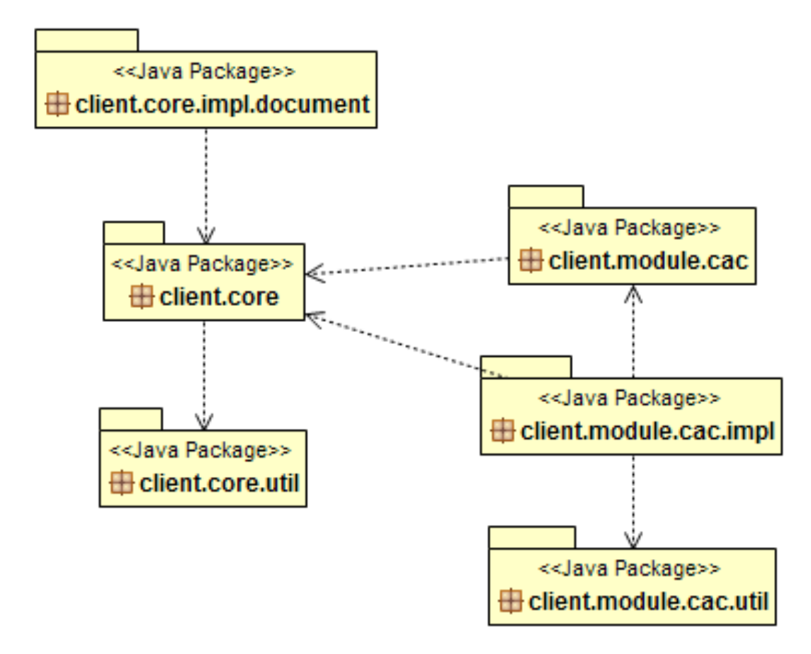
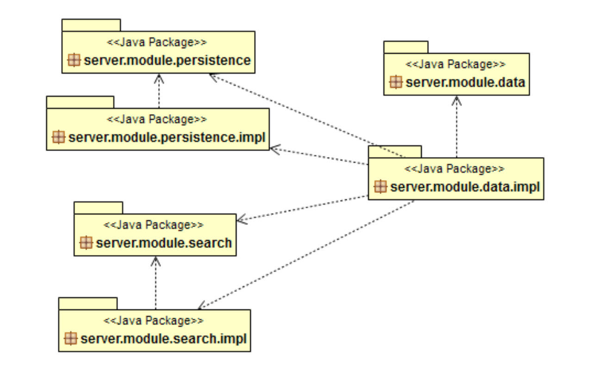
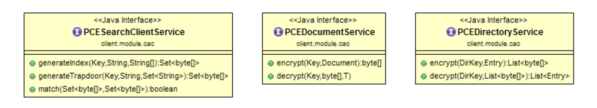
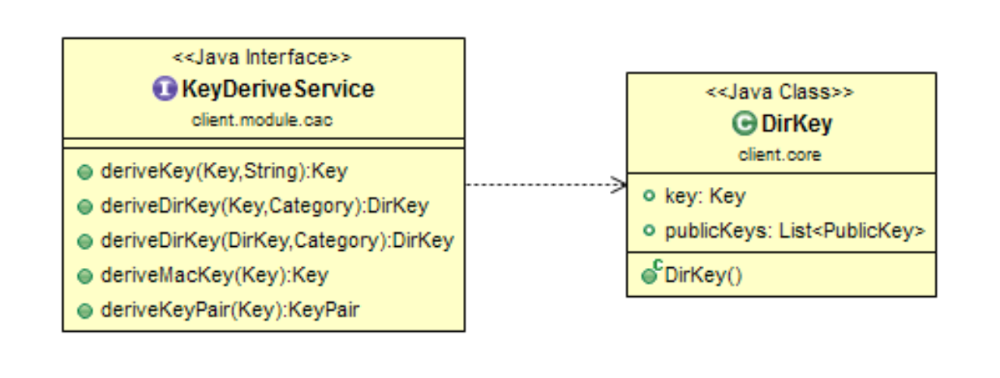

# User Controlled Encryption
Dies ist eine Implementierung einer kryptographischen Zugriffskontrolle um Daten vertraulich in einem nicht-vertrauenswürdigen Umfeld (z.B. Cloud) auszutauschen.

Die Bestandteile der Implementation sind dabei:
* Verschlüsselte Dokumente 
* Verschlüsseltes Verzeichniss (Baumstruktur)
* Verschlüsselte Indexe für die vertrauliche Suche auf verschlüsselten Suchwörtern.

## Über
Die Implementierung basiert im Wesentlichen auf der symmetrischen Variante der wissenschaftlichen Veröffentlichung '_Patient Controlled Encryption: Ensuring Privacy of Electronic Medical Records_' von Josh Benaloh, Melissa Chase, Eric Horvitz and Kristin Lauter von Microsoft Research. Nachfolgend als PCE bezeichnet.

Diese Implementierung korrigiert zudem Lücken, welche das theoretische Konzept von PCE aufweist:

* PCE speichert Verzeichniseinträge als Tupel der Form `LocatorDoc, Category, DocName`. Als `Category` wird lediglich der Kategoriename verwendet. Dies führt dazu, dass aus den verschlüsselten Daten niemals wieder die originale Baumstruktur der Kategorien hergeleitet werden kann. Um diesen Umstand zu korrigieren ersetzt diese Implementierung den Kategorienamen aus `Category` durch den gesamten Kategoriepfad.
* PCE verschlüsselt Verzeichniseinträge direkt mittels einem  asymmetrischen Verfahren. Dadurch wird die Länge des Verzeichnisnames resp. Pfades direkt an die Länge des Schlüssels gebunden. Diese Implementierung setzt stattdessen auf ein hybrides Verfahren, dass zusätzlich einen symmetrischen Schlüssel einsetzt und diesen wiederum mit dem asymmetrischen Schlüssel sichert.

## Implementierungsdetails
Die Implementierung basiert auf Java > 1.8 und des alternativen  Java Cryptography Extension Providers `Bouncy Castle`.

### Module und Klassen
Datenverwaltung: 

Datenspeicher:

### Interfaces
Schlüsselwortsuche mittels Trapdoor:

Schlüsselherleitung:

[1]: https://www.microsoft.com/en-us/research/wp-content/uploads/2016/02/PCE-CCSW.pdf